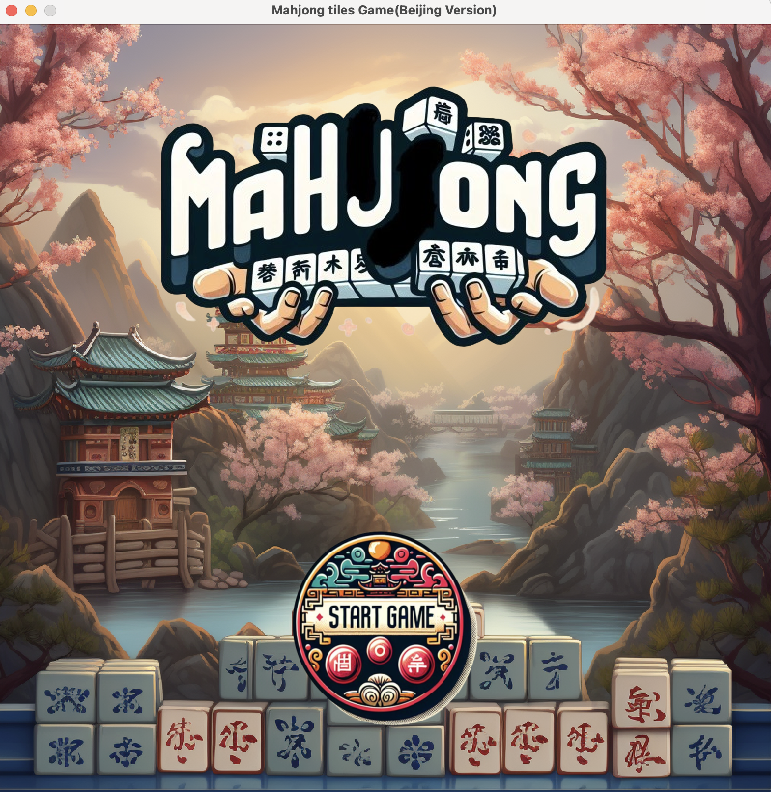

# Mahjong Game 2

In a Java Mahjong game, traditional Mahjong rules are typically simulated, and players can interact with the game using a mouse. The game usually includes classic Mahjong gameplay elements such as drawing tiles, forming sets (like Pongs and Kongs), declaring Mahjong, and players need to arrange the tiles in their hands into valid combinations to achieve victory.

## Catalogue

- [Introduction](#Introduction)
- [Importance](#Importance)
- [Contribution](#Contribution)
- [Connect information](#Connect)

## Introduction
In this game, the player competes against three computer opponents:

1. At the start of each round, the player must click the “Touch” button to draw a tile
   (this is very important, as you cannot play a tile without drawing one first).

2. Click on the tile you wish to play. The selected tile will rise slightly to indicate it has been chosen.

3. After selecting the tile, click the “Select” button to play it.

4. The computer opponents will automatically play their tiles. The player does not need to take any action and should just wait.

5. At the start of the next round, the player must draw a tile again and repeat the steps.

This process continues in the same manner.

## Importance
 &#9829;When playing a regular tile, the player selects and plays one tile at a time.
 
 &#9829;When special moves like Chi, Pong, or Kong are available, the player can select and play multiple tiles.
 
&#9829;When the player believes they have a winning hand, they should click the “Draw” button. If the hand meets the winning conditions, the game will declare the player victorious, and the game will end.

## Project screenshot

## Contribution
February (Zhiqiao Zhang):Responsible for front-end page design and code implementation.

Jacksion (Jialu Zhang): Responsible for back-end code implementation of the game. 

Yuki (Siqi Du):Responsible for assisting in debugging and fixing issues for both front-end and back-end. 

Chiao (Zongxiang Jiao):Responsible for writing materials and participating in design discussions.

## Connect 
If you have any questions or suggestions, you can contact me at:

February personal email: 2298540110@qq.com

GitHub: February040202

